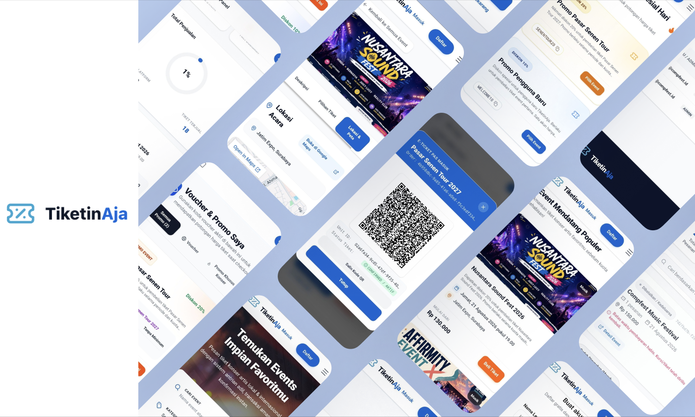
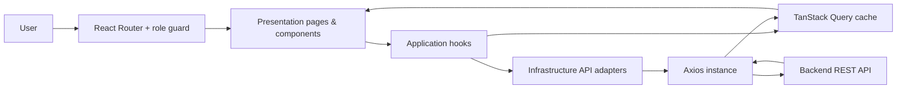

# TiketinAja — Frontend

Frontend aplikasi reservasi tiket event berkapasitas terbatas untuk studi kasus **COMPFEST SEA 18 — Sell Without Overselling**. Aplikasi ini mendukung pengalaman pembelian saat trafik tinggi, serta workspace untuk buyer, organizer, gate operator, dan administrator.

> Repositori ini hanya berisi aplikasi klien. Jaminan terhadap overselling, idempotensi pembayaran/refund, dan konsistensi inventori berada pada backend API.

## Daftar isi

- [Latar belakang](#latar-belakang)
- [Preview dan demo](#preview-dan-demo)
- [Fitur](#fitur)
- [Peran pengguna](#peran-pengguna)
- [Teknologi](#teknologi)
- [Arsitektur frontend](#arsitektur-frontend)
- [Alur utama](#alur-utama)
- [Struktur proyek](#struktur-proyek)
- [Menjalankan secara lokal](#menjalankan-secara-lokal)
- [Konfigurasi environment](#konfigurasi-environment)
- [Daftar rute](#daftar-rute)
- [Integrasi API](#integrasi-api)
- [Quality checks dan deployment](#quality-checks-dan-deployment)
- [Batasan iterasi](#batasan-iterasi)

## Latar belakang

Tiket adalah inventori terbatas: sebuah unit tiket atau kursi hanya boleh dimiliki satu pembeli yang berhasil. Saat penjualan event populer dibuka, banyak pengguna dapat mencoba memesan kuota yang sama secara bersamaan.

Frontend ini mendukung lifecycle studi kasus berikut:

```text
Available → Held → Payment Pending → Confirmed/Paid
                         │
                         └→ Expired/Canceled → Available

Paid → Refund Requested → Organizer Approved → Refunded
Paid → QR validated at gate → Admitted
```

Antarmuka bukan sumber kebenaran inventori. Setiap hold, pembuatan order, pembayaran, refund, dan scan QR dikonfirmasi API agar keputusan bisnis tetap atomik di backend.

## Preview dan demo



Tonton video demo : [YouTube — TiketinAja](https://youtu.be/j1kvmB2Sdc4).

## Fitur

- Jelajah, cari, filter, dan lihat detail event serta kategori tiket.
- Waiting room / antrean untuk event bertrafik tinggi, termasuk polling posisi dan queue token.
- Reservasi sementara (*ticket hold*) dengan countdown hingga `held_until`.
- Checkout tiket, promo event, validasi voucher, pembuatan order, dan redirect invoice pembayaran.
- Halaman callback/status pembayaran.
- Tiket saya: pencarian, pagination, ringkasan status, pembayaran ulang, QR tiket, dan pengajuan refund.
- Workspace organizer: CRUD event, upload gambar, ticket type, metrik, penugasan gate operator, dan persetujuan refund.
- Pemindaian QR oleh gate operator, riwayat scan, dan statistik gate.
- Dashboard admin: dispute, override status order, reassign tiket, promo/voucher, metrik, dan audit log.
- Login, registrasi, profil, ubah username/kata sandi, dan proteksi rute berbasis role.

## Peran pengguna

| Peran | Kemampuan utama |
| --- | --- |
| `BUYER` | Memilih event, masuk antrean, hold tiket, checkout, membayar, melihat QR tiket, dan mengajukan refund. |
| `ORGANIZER` | Mengelola event/ticket type, melihat performa event, mengatur gate operator, dan menyetujui refund. |
| `GATE_OPERATOR` | Memindai serta memvalidasi QR tiket saat masuk venue. |
| `ADMIN` | Menangani dispute, override status, reassign tiket, mengelola promo, dan meninjau audit log. |

## Teknologi

| Area | Teknologi |
| --- | --- |
| Framework | React 19 + TypeScript |
| Build tool | Vite 8 |
| Styling | Tailwind CSS 4 |
| Routing | React Router 7 |
| Server state | TanStack React Query 5 |
| HTTP client | Axios |
| QR | `qrcode.react` dan `html5-qrcode` |
| Notifikasi | SweetAlert2 |
| Ikon & animasi | Lucide React dan Lottie React |
| Linting | ESLint + TypeScript ESLint |
| Hosting SPA | Vercel (`vercel.json` menyediakan fallback rewrite) |

## Arsitektur frontend

Kode disusun per feature/module. Setiap modul umumnya memisahkan `presentation` (UI), `application` (hooks/query/mutation), `infrastructure` (adapter REST API), dan `domain` (model/tipe bisnis).



`src/core/api/axiosInstance.ts` menambahkan Bearer token dari `localStorage` ke request terautentikasi. Respons `401` dari pengecekan sesi (`/auth/me`) membersihkan sesi lokal. Konfigurasi query default menggunakan satu kali retry dan `staleTime` 30 detik; antrean dan daftar refund organizer memakai interval refresh tersendiri.

## Alur utama

### Pembelian bertrafik tinggi

1. Buyer membuka detail event dan memilih jumlah tiket.
2. Buyer bergabung ke antrean. Jika belum diizinkan masuk, UI melakukan polling status setiap 3 detik.
3. Saat status `ready`, backend memberikan queue token. Token dikirim pada header `X-Queue-Token` ketika melakukan hold dan membuat order.
4. Frontend meminta hold tiket dan menampilkan waktu berakhirnya reservasi dari respons API.
5. Dari unit tiket hasil hold, frontend membuat order lalu meminta invoice pembayaran.
6. Buyer diarahkan ke halaman pembayaran; halaman callback mengambil status order terbaru dari backend.

Konflik kuota (`409`) ditampilkan bahwa kuota telah habis atau sedang dipegang buyer lain. Backend tetap bertanggung jawab memastikan request bersamaan tidak dapat mengonfirmasi unit yang sama.

### Refund dan admission

1. Buyer mengajukan refund dari **Tiket Saya**.
2. Organizer menyetujui pengajuan; pencairan dan status akhir diproses backend/admin.
3. Buyer menampilkan QR per unit tiket dan gate operator memindainya.
4. Hasil scan berasal dari API agar validasi single-entry tetap konsisten saat beberapa gate aktif.

## Struktur proyek

```text
src/
├── core/                         # Konfigurasi, axios, router, React Query, utilitas
├── modules/
│   ├── admin/                    # Dispute, audit log, metrik, promo/voucher
│   ├── auth/                     # Login, register, sesi, assignment operator
│   ├── buyer/                    # Tiket saya dan promo buyer
│   ├── events/                   # Katalog serta detail event
│   ├── gate-operator/            # QR issuance, scanner, dan riwayat check-in
│   ├── home/                     # Landing page
│   ├── inventory/                # Queue, ticket hold, checkout
│   ├── orders/                   # Order, pembayaran, callback, refund API
│   ├── organizer/                # Event, ticket type, operator, analytics, refund
│   └── profile/                  # Profil dan kredensial akun
├── shared/                       # Layout, komponen UI, hooks, utilitas bersama
├── assets/                       # Ilustrasi, gambar, dan animasi
├── App.tsx
├── main.tsx
└── index.css
```

## Menjalankan secara lokal

### Prasyarat

- Node.js 20 LTS atau versi yang kompatibel dengan Vite 8
- npm
- Backend API yang berjalan dan dapat diakses

### Instalasi

```bash
git clone https://github.com/Compfest18-SWA-Team-2-Gokil/Fe-Booking-Events.git
cd Fe-Booking-Events
npm install
cp .env.example .env
npm run dev
```

Vite akan menampilkan alamat lokal aplikasi (umumnya `http://localhost:5173`). Tanpa `VITE_API_BASE_URL`, aplikasi menggunakan `http://localhost:8080` sebagai alamat backend.

## Konfigurasi environment

Buat file `.env` di root proyek:

```dotenv
# URL backend REST API, tanpa trailing slash
VITE_API_BASE_URL=http://localhost:8080
```

Contoh deployment:

```dotenv
VITE_API_BASE_URL=https://api.example.com
```

Nilai tanpa protokol didukung dan akan diperlakukan sebagai HTTPS. Jangan menyimpan secret di `VITE_*`, karena variabel tersebut dibundel ke browser.

Saat development, `vite.config.ts` juga mem-proxy request `/api` ke `http://localhost:8080`.

## Daftar rute

| Akses | Rute | Halaman |
| --- | --- | --- |
| Publik | `/` | Landing page |
| Publik | `/login`, `/register` | Autentikasi |
| Publik / login | `/events`, `/events/:id` | Katalog dan detail event |
| Publik / login | `/payment/callback`, `/payment/success`, `/payment/finish`, `/payment/result`, `/orders/:orderId/status` | Status pembayaran |
| Semua role login | `/me` | Profil |
| Buyer | `/checkout/:id`, `/my-tickets`, `/my-promos` | Checkout, tiket, promo |
| Organizer | `/organizer/my-events`, `/organizer/refunds` | Event dan refund |
| Organizer | `/organizer/events/create`, `/organizer/events/:eventId/edit` | Buat/ubah event |
| Organizer | `/organizer/events/:eventId/ticket-types`, `/organizer/events/:eventId/gate-operators` | Ticket type dan gate operator |
| Admin | `/admin/dashboard` | Operasional admin |
| Gate operator | `/gate/scan` | Pemindaian QR |

Rute terlindungi mengarahkan pengguna tanpa sesi ke `/login`. Pengguna dengan role yang tidak sesuai dialihkan ke beranda sesuai rolenya.

## Integrasi API

Frontend mengonsumsi REST API dengan prefix `/api/v1`. Domain yang diintegrasikan mencakup:

| Domain | Contoh operasi |
| --- | --- |
| Auth & profil | register, login, logout, `auth/me`, ubah username/password |
| Event | list/detail event, CRUD event, upload image, ticket type, metrik |
| Queue & inventory | join/status queue, validasi queue token, hold tiket |
| Order & payment | create/get order, membuat invoice pembayaran, callback status |
| Promo | promo/voucher aktif, validasi voucher, CRUD promo admin |
| Refund | request refund, persetujuan organizer, daftar refund |
| Check-in | issue QR dan scan QR |
| Admin | dispute, override order, reassign ticket, audit log |

Kontrak request/response dan otorisasi akhir mengikuti backend. Untuk operasi yang menuntut konsistensi (hold, order, payment callback, refund, scan), idempotency dan transaksi atomik wajib ada di backend—bukan hanya pada UI.

## Quality checks dan deployment

```bash
# Menjalankan development server
npm run dev

# Memeriksa lint
npm run lint

# Type-check lalu membuat build produksi
npm run build

# Menjalankan hasil build secara lokal
npm run preview
```

`vercel.json` me-rewrite seluruh path ke `index.html`, sehingga refresh pada rute React Router tetap berfungsi di Vercel. Atur `VITE_API_BASE_URL` pada environment deployment sebelum build.

## Batasan iterasi

- Ini adalah frontend web; aplikasi mobile native tidak termasuk.
- Pembayaran diproses backend dan payment provider. Frontend hanya memulai pembayaran serta menampilkan statusnya.
- Konsistensi bisnis tidak boleh bergantung pada client. Backend harus memverifikasi token, role, queue token, kepemilikan order, status tiket, dan callback pembayaran.
- Pengujian end-to-end, observability backend, database lock, serta worker expiry hold berada di luar repositori ini.

## Repository

<https://github.com/Compfest18-SWA-Team-2-Gokil/Fe-Booking-Events>
